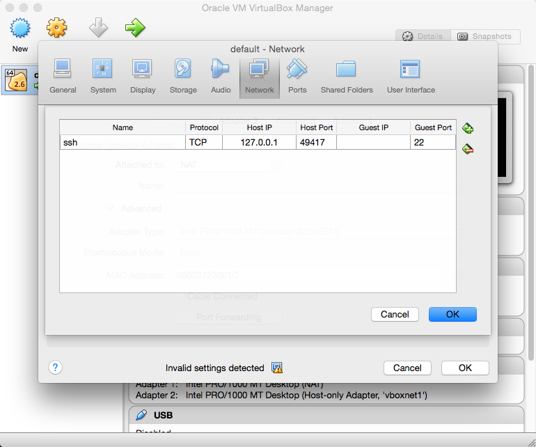

# docker-vpn-helper

###How does Docker work on OSX?
[docker-machine](https://docs.docker.com/machine/) leverages VirtualBox to create a boot2docker VM (based on Tiny Core Linux) that exposes the required kernel facilities (e.g., cgroups and namespaces) needed by the Docker daemon.  The Docker client for OSX relies on the Docker daemon running within the boot2docker VM to perform all of its actions.


###How does this affect me?
A VirtualBox host-only network adapter is used to facilitate communication between the [Docker client running on the physical host and the Docker daemon within the boot2docker VM](https://docs.docker.com/introduction/understanding-docker/).  VirtualBox normally adds routes for this to the routing table.  Unfortunately, the Cisco AnyConnect VPN agent manages the routing table with an iron fist and redirects all routes into its `utun0` interface.  This effectively cuts off communication to the Docker daemon running inside of the boot2docker VM.

#####Before connecting to the VPN:
```
$ netstat -nr
Routing tables

Internet:
Destination        Gateway            Flags        Refs      Use   Netif Expire
<SNIP>
192.168.99         link#11            UC              1        0 vboxnet
192.168.99.100     8:0:27:0:ed:24     UHLWIi          3       11 vboxnet   1179
<SNIP>
```

#####After connecting to the VPN:
```
$ netstat -nr
Routing tables

Internet:
Destination        Gateway            Flags        Refs      Use   Netif Expire
<SNIP>
192.168.99         link#9             UCS             0        0   utun0
<SNIP>
```

Some additional information can be found [here](https://github.com/docker/machine#docker-machine-hangs).
> Are you using a VPN? If so, try disconnecting and see if creation will succeed without the VPN. Some VPN software aggressively controls routes and you may need to [manually add the route](https://github.com/docker/machine/issues/1500#issuecomment-121134958).

 
###What can I do about this?
The boot2docker VM is also configured with a NAT interface and VirtualBox supports the ability to forward ports between the physical host and the guest VM when using this.  By default, docker-machine maps port `22` of the boot2docker VM to a randomly selected port (e.g., `49417`) on the physical host (it's also configured to only accept connections from `localhost`, but that's a separate discussion).  
  
The `docker-machine ssh <machine_name>` command leverages this feature and executes a command like this behind-the-scenes:
> __/usr/bin/ssh__ -o PasswordAuthentication=no -o IdentitiesOnly=yes -o StrictHostKeyChecking=no -o UserKnownHostsFile=/dev/null -o LogLevel=quiet -o ConnectionAttempts=3 -o ConnectTimeout=10 -i /Users/jonathan.li/.docker/machine/machines/default/id_rsa  __-p 49417 docker@localhost__

We can restore communication if we also forward the port used by the Docker daemon!


###What's the catch?
The Docker daemon and client are secured with [mutual authentication](https://docs.docker.com/articles/https/).  docker-machine creates the certificates for both the daemon and the client.  Unfortunately, the certificate created for the Docker daemon only contains the IP address of the host-only network adapter (e.g., `192.168.99.100`).  This means that the Docker client will only trust the certificate if it communicates with the Docker daemon over the host-only network adapter...which is broken by the Cisco AnyConnect VPN agent.

```
$ openssl x509 -noout -text -in server.pem 
Certificate:
        Subject: O=default
        Subject Public Key Info:
            Public Key Algorithm: rsaEncryption
                Public-Key: (2048 bit)
                Modulus:
                    <SNIP>
                Exponent: 65537 (0x10001)
        X509v3 extensions:
            X509v3 Key Usage: critical
                Digital Signature, Key Encipherment, Key Agreement
            X509v3 Extended Key Usage: 
                TLS Web Client Authentication, TLS Web Server Authentication
            X509v3 Basic Constraints: critical
                CA:FALSE
            X509v3 Subject Alternative Name: 
                IP Address:192.168.99.100
    Signature Algorithm: sha256WithRSAEncryption
         <SNIP>
```

If we also forward the Docker daemon port (i.e., `2376`) between the guest VM and the physical host, the last hurdle to enabling communication between the Docker daemon and client is to create a new certificate that also supports `localhost` and `127.0.0.1`.


###Now what?
This script will help you:
* Create a new boot2docker VM (or apply the necessary changes to an existing VM)
* Add a port forwarding rule for the Docker daemon port
* Create and deploy a new certificate for the Docker daemon
* Add the environment variables needed by the Docker client


###Requirements for creating a new VM
* You must be __disconnected__ from the VPN  
  _NOTE: This requirement does not apply when updating an existing VM_
  ```
$ ./docker-vpn-helper
Please disconnect from the VPN
```

* All VirtualBox processes must be stopped (i.e., all VMs and the GUI)
  ```
$ ./docker-vpn-helper 
Please stop all VirtualBox.app processes
33540 33542 33571 36180
```

* Your sudo password must be entered when restarting the VirtualBox kernel modules
  ```
$ ./docker-vpn-helper 
=====Restarting VirtualBox kernel modules=====
Password:
```

###What's it look like?
1. Let's make sure we're starting fresh
  ```
$ docker-machine ls
NAME   ACTIVE   DRIVER   STATE   URL   SWARM
```

2. Run the helper script
  ```
$ ./docker-vpn-helper 
=====Restarting VirtualBox kernel modules=====
Password:
Unloading VBoxUSB.kext
Unloading VBoxNetFlt.kext
Unloading VBoxNetAdp.kext
Unloading VBoxDrv.kext
Loading VBoxDrv.kext
Loading VBoxUSB.kext
Loading VBoxNetFlt.kext
Loading VBoxNetAdp.kext
=====[default] Creating Docker host=====
Creating VirtualBox VM...
Creating SSH key...
Starting VirtualBox VM...
Starting VM...
To see how to connect Docker to this machine, run: docker-machine env default
=====[default] Inserting Docker daemon port forwarding rule=====
=====[default] Creating a new Docker daemon certificate=====
Signature ok
subject=/CN=localhost
Getting CA Private Key
=====[default] Deploying Certificate to Docker host=====
-----BEGIN CERTIFICATE-----
<snip>
-----END CERTIFICATE-----
=====[default] Restarting Docker daemon=====
Need TLS certs for default,127.0.0.1,10.0.2.15,192.168.99.100
-------------------
=====Add these to your environment=====
export DOCKER_TLS_VERIFY=1
export DOCKER_HOST=tcp://localhost:2376
export DOCKER_CERT_PATH=/Users/jonathan.li/.docker/machine/machines/default
export DOCKER_MACHINE_NAME=default
```

3. Let's make sure a VM was created
  ```
$ docker-machine ls
NAME      ACTIVE   DRIVER       STATE     URL                         SWARM
default            virtualbox   Running   tcp://192.168.99.100:2376 
```

4. Export the environment variables and test it out
  ```
$ export DOCKER_TLS_VERIFY=1
$ export DOCKER_HOST=tcp://localhost:2376
$ export DOCKER_CERT_PATH=/Users/jonathan.li/.docker/machine/machines/default
$ export DOCKER_MACHINE_NAME=default

$ docker version
Client:
 Version:      1.8.2
 API version:  1.20
 Go version:   go1.4.2
 Git commit:   0a8c2e3
 Built:        Thu Sep 10 19:10:10 UTC 2015
 OS/Arch:      darwin/amd64

Server:
 Version:      1.8.2
 API version:  1.20
 Go version:   go1.4.2
 Git commit:   0a8c2e3
 Built:        Thu Sep 10 19:10:10 UTC 2015
 OS/Arch:      linux/amd64
```

###What's it look like...when something goes wrong?
* If you forget to export the environment variables
  ```
$ docker images
Get http:///var/run/docker.sock/v1.20/images/json: dial unix /var/run/docker.sock: no such file or directory.
* Are you trying to connect to a TLS-enabled daemon without TLS?
* Is your docker daemon up and running?
```

* If you're on the VPN and export the environment variables from `docker-machine env <machine_name>` instead of from this helper script  
  _NOTE: This'll work fine if you've recently rebooted and have never connected to the VPN_
  ```
$ docker images
An error occurred trying to connect: Get https://192.168.99.100:2376/v1.20/images/json: dial tcp 192.168.99.100:2376: i/o timeout
```

* If the Docker daemon's certificate doesn't include `localhost` or `127.0.0.1`
  ```
$ export DOCKER_TLS_VERIFY=1
$ export DOCKER_HOST=tcp://localhost:2376
$ export DOCKER_CERT_PATH=/Users/jonathan.li/.docker/machine/machines/default
$ export DOCKER_MACHINE_NAME=default

$ docker images
An error occurred trying to connect: Get https://localhost:2376/v1.20/images/json: x509: certificate is valid for , not localhost
```
  _NOTE: You can fix this by re-running this helper script_
  ```
$ ./docker-vpn-helper 
=====[default] Creating a new Docker daemon certificate=====
Signature ok
subject=/CN=localhost
Getting CA Private Key
=====[default] Deploying Certificate to Docker host=====
-----BEGIN CERTIFICATE-----
<snip>
-----END CERTIFICATE-----
=====[default] Restarting Docker daemon=====
Need TLS certs for default,127.0.0.1,10.0.2.15,192.168.99.100
-------------------
=====Add these to your environment=====
export DOCKER_TLS_VERIFY=1
export DOCKER_HOST=tcp://localhost:2376
export DOCKER_CERT_PATH=/Users/jonathan.li/.docker/machine/machines/default
export DOCKER_MACHINE_NAME=default

$ docker images
REPOSITORY          TAG                 IMAGE ID            CREATED             VIRTUAL SIZE
```
